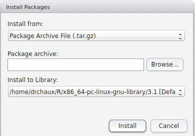

# swirl (en español)

[](https://travis-ci.org/swirldev/swirl)

swirl es una plataforma para aprender (y enseñar) estadística y R simultánea e interactivamente. Para instalar el paquete original en inglés sigue las instrucciones dadas en el sitio web oficial de swirl en [http://swirlstats.com](http://swirlstats.com). Este repositorio contiene la versión en español de swirl, traducida por [Alcides Chaux](https://github.com/alcideschaux), a partir del repositorio original del paquete ubicado en [https://github.com/swirldev/swirl](https://github.com/swirldev/swirl). Las siguientes indicaciones toman como base lo incluido en el repositorio original.

swirl contiene una selección de lecciones de cursos e interactivamente entrena al usuario a través de las mismas. Se puede pedir a un usuario que vea un video, que responda una pregunta de opción múltiple o de completa los espacios en blanco, o ingresar un comando en la consola de R precisamente como si estuviese usando R en la práctica. Se pone el énfasis en lo último, el interactuar con la consola de R. Las respuestas de los usuarios son evaluadas para ver si son correctas y se brindan pistas de ser apropiado. El progreso se guarda automáticamente de modo a que un usuario puede salir en cualquier momento y reiniciar la lección más tarde sin perder el trabajo hecho.

swirl depende mucho del ejercitamiento en el uso de la consola de R por parte del estudiante. Un mecanismo de retrollamada, sugerido y demostrado primero para tal propósito por Hadley Wickham, se utiliza para capturar la respuesta del estudiante y para proveer retroalimentación inmediata relevante para el material del curso a mano.

## Instalando swirl (versión en español)
### Desde GitHub
Para instalar la versión en español de `swirl` debes instalar primero el paquete `devtools` desde CRAN. Inicia R/Rstudio y escribe lo siguiente en la consola de R:

```
install.packages("devtools")
```
Una vez instalado el paquete `devtools`debes cargarlo usando el comando:

```
library(devtools)
```

Una vez cargada la librería instala la versión en español de swirl contenida en este repositorio con el siguiente comando:

```
install_github("alcideschaux/swirl-spa")
```

### Desde un archivo local
Si experimentas problemas instalando `swirl` en español desde este repositorio de GitHub, puedes instalar el paquete desde un archivo local. Para hacer ésto sigue estos pasos:
1. Baja el paquete haciendo click en [swirl-spa.tar.gz](https://github.com/alcideschaux/swirl-spa/blob/master/swirl-spa.tar.gz) y luego en "Raw".
2. Lanza RStudio y accede al instalador de paquetes desde `Tools -> Install Packages...` (ver Figura).
3. Despliega el menú de `Install from:` y selecciona para instalar desde `Package Archive File`. Ahí se abrirá una ventana en el navegador del sistema operativo. Selecciona el archivo que bajaste en el paso 1.
4. Haz click en `Install`. Eso es todo.



## Lanzando swirl
Una vez finalizada la descarga e instalación del paquete puedes iniciar el programa con `swirl()`. Las funciones que controlan el comportamiento de swirl incluyen `bye()` para salir, `skip()` para saltarse una pregunta, `main()` para regresar al menú principal, `play()` para permitir la experimentación en la consola de R sin la interfaz de swirl, `nxt()` para reiniciar la interacción con swirl, e `info()` para mostrar un menú de ayuda.

## Instalando cursos
swirl en español puede correr todos los cursos que se encuentran disponibles en el repositorio oficial de swirl en [https://github.com/swirldev/swirl_courses#swirl-courses](https://github.com/swirldev/swirl_courses#swirl-courses). Adicionalmente, se pueden instalar los mismos cursos en español desde el repositorio del Dr. Alcides Chaux en [https://github.com/alcideschaux](https://github.com/alcideschaux). Los cursos en español disponibles son:

* **Programación en R**, disponible en [https://github.com/alcideschaux/Programacion_en_R](https://github.com/alcideschaux/Programacion_en_R).
* **Introducción a la Estadística** \*
* **Análisis de Datos** \*
* **Estadística Inferencial** \*
* **Modelos de Regresión** \*

\* en preparación

Se debe tener en cuenta que la lista de cursos en español seguirá creciendo con el tiempo, por lo que es conveniente visitar regularmente este repositorio.

## Uso de los cursos
Siguiendo la política establecida en el repositorio oficial de swirl, este programa (swirl en español) y todos los cursos traducidos al español pueden utilizarse libre y gratuitamente.

## Reporte de errores
Si encuentras algún error en el programa o alguno de los cursos por favor notificalo a [alcideschaux@uninorte.edu.py](mailto:alcideschaux@uninorte.edu.py).